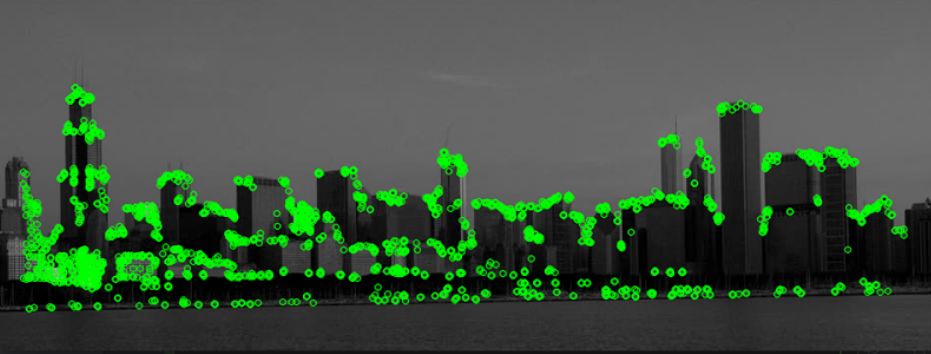

# skyline_detector
A computer vision pipeline for detecting which city a picture is taken in by the skyline. 

Uses OpenCV scikit-learn.

Cities used:
- Shanghai
- New York City
- Chicago
- London

[Training Data](https://drive.google.com/open?id=1zQekbHjcFZ8eT5-Zyr3GLjnI3YrGtPeQ) | 
[Testing Data](https://drive.google.com/open?id=1YQEi54KiP8hrFtUcqO59MIGGJBnRshD-)

Example of a processed image:

